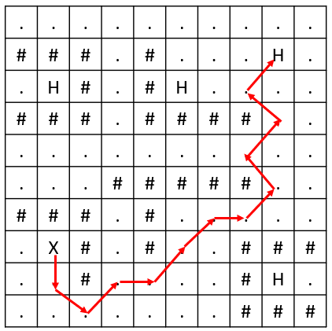

# Hospital Recommendation App

As a student of IIT Madras, you are part of a project to develop a hospital recommendation application for Chennai. The app is designed to assist residents in quickly finding the nearest hospital during medical emergencies. Due to ongoing infrastructure projects, road repairs, and other obstacles, some paths are blocked, making it important to navigate efficiently.

The city is represented as an `n x m` grid, where each cell represents a specific area. Some areas are accessible (represented by `.`), while others are blocked (represented by `#`). Multiple hospitals are spread throughout the city, and they are all marked as `H` in the grid. Your current location can be fetched via GPS and is represented as `X` in the grid.

You can move between any adjacent accessible areas, and going from one location to an adjacent location takes approximately **5 minutes**. Your task is to help the developers by writing an algorithm that determines the nearest hospital from your current location `X`, and calculates the minimum time required to reach it.

If it is possible to reach one or more hospitals, the algorithm should output the minimum time required to reach the hospital, and the path taken from your current location to that hospital in terms of the exact sequence of coordinates. If multiple hospitals are equidistant, the hospital that appears first in the grid (top to bottom, left to right) should be prioritized. If multiple paths are equidistant, print any one of them. If no hospital can be reached, return `-1`.

## Input Format

- The first line contains two integers `n` and `m`, representing the number of rows and columns in the grid.

- The next `n` lines each contain `m` characters separated by spaces, representing the grid layout. Each character in the grid can be one of the following:
  - `.`: an accessible area.
  - `#`: a blocked area.
  - `H`: a hospital.
  - `X`: your current location, fetched via GPS.

## Output Format

- If it is possible to reach one or more hospitals:
  - The first line should contain the minimum time `t` (in minutes) required to reach the nearest hospital.

  - The next `(t/5) + 1` lines must provide a sequence of index pairs starting from the current location to the destination hospital. Index pairs must be printed in the form `i j` (i.e., space separated without parenthesis or commas). See sample test cases for clarity.

- If no hospital is reachable, print `-1`.

## Constraints
- 2 ≤ n, m ≤ 1000

## Sample Inputs and Outputs

### Sample Input 1
```
10 10
. . . . . . . . . .
# # # . # . . . H .
. H # . # H . . . .
# # # . # # # # . .
. . . . . . . . . .
. . . # # # # # . .
# # # . # . . . . .
. X # . # . . # # #
. . # . . . . # H .
. . . . . . . # # #
```

### Sample Output 1
```
60
7 1
8 1
9 2
8 3
8 4
7 5
6 6
6 7
5 8
4 7
3 8
2 7
1 8
```

### Explanation 1
In this example, the user starts at location `(7,1)` and the nearest hospital is at `(1,8)`, which can be reached in 60 minutes. The user follows the path `(7,1) → (8,1) → (9,2) → (8,3) → (8,4) → (7,5) → (6,6) → (6,7) → (5,8) → (4,7) → (3,8) → (2,7) → (1,8)`. Each move between adjacent accessible cells takes 5 minutes, and since there are 12 moves, the total time is 60 minutes.


